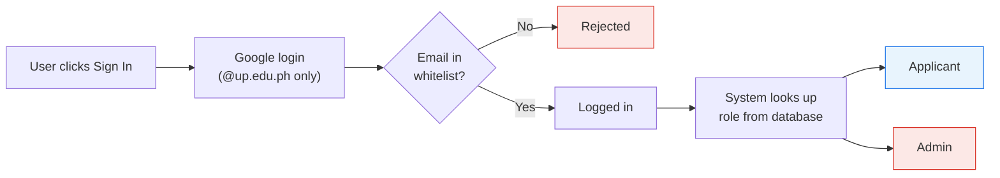
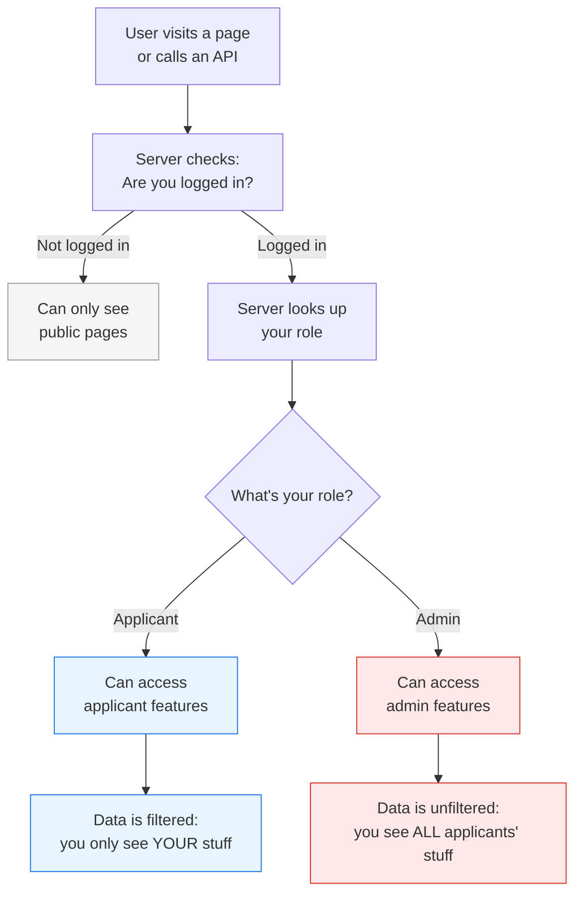
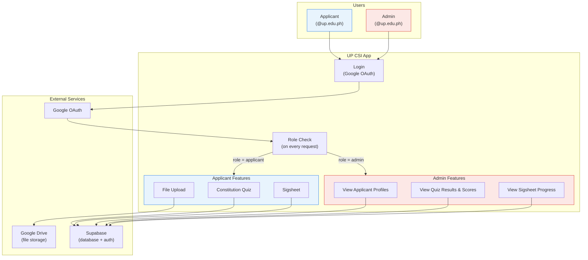
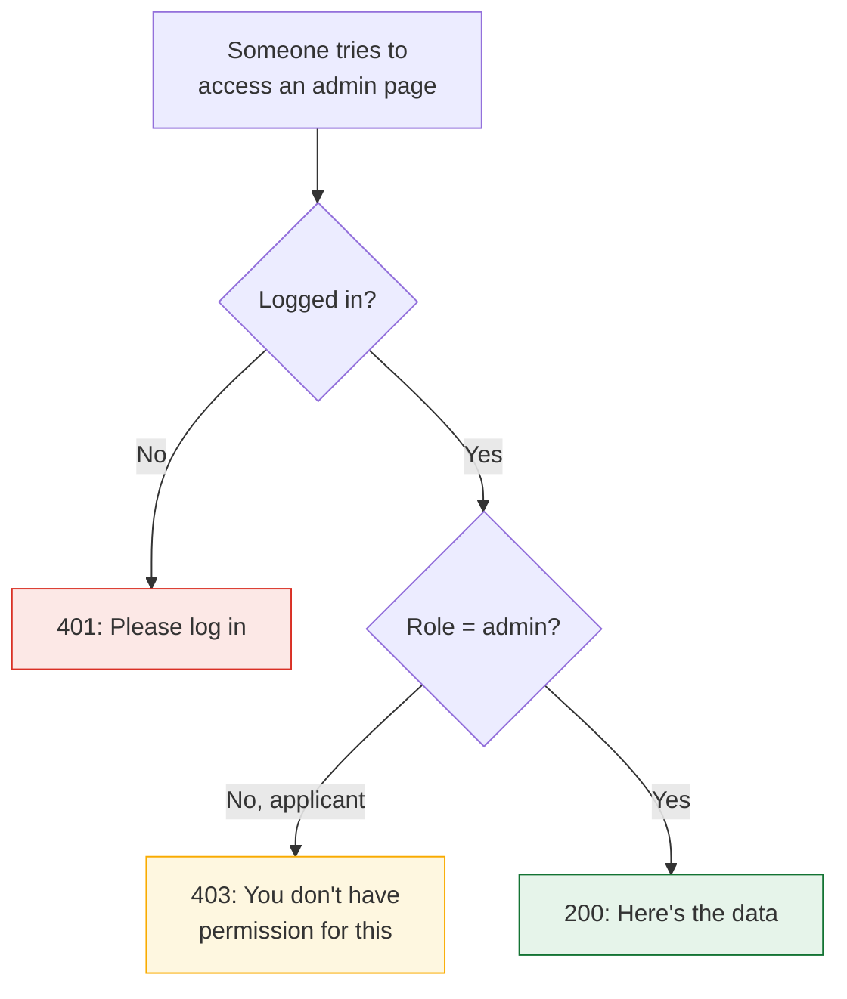
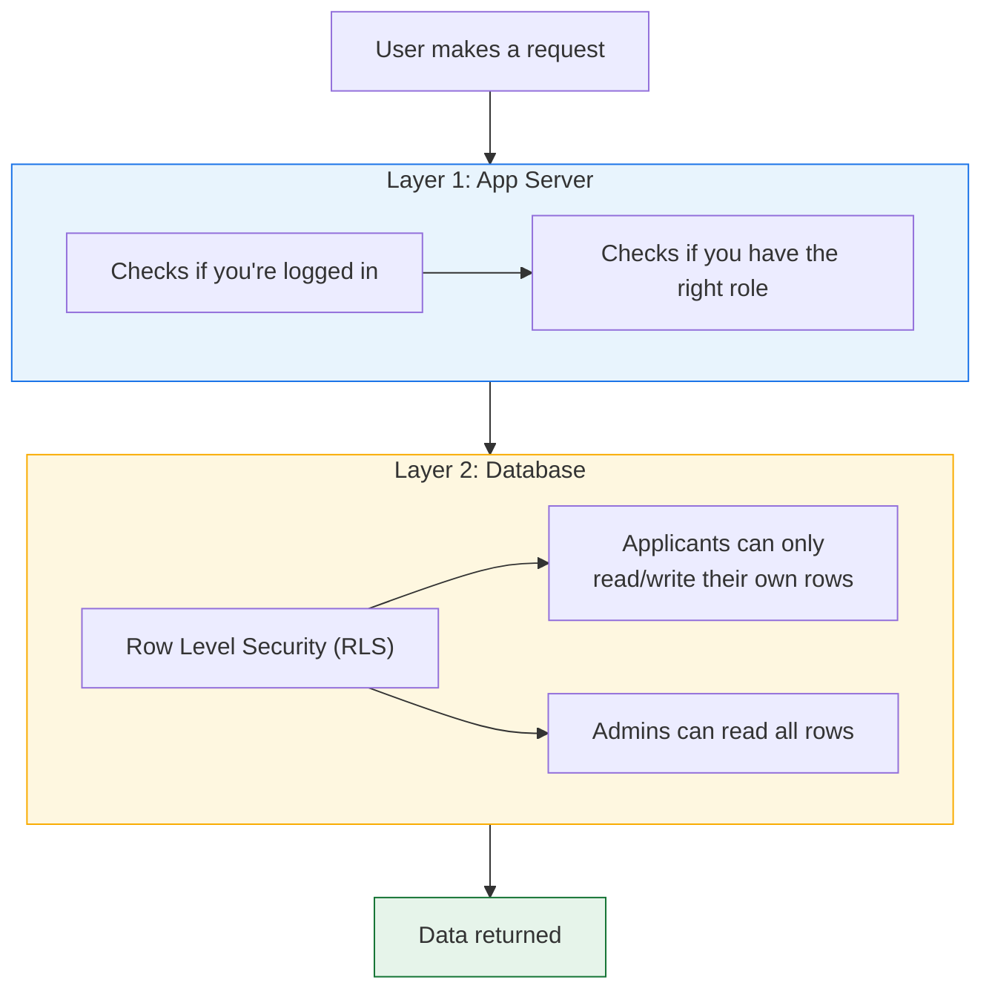

# Admin Roles — System Overview Diagrams

> Companion to `1-admin-roles-implementation-plan.md`.
> Diagrams use Mermaid syntax — rendered natively on GitHub. To use in Excalidraw, paste the code blocks into the "Mermaid to Excalidraw" feature (wand icon).

---

## 1. How Sign-In Works

Everyone signs in the same way. The system figures out your role after you log in.

---

## 2. What Each Role Can See and Do

```mermaid
flowchart TB
    subgraph NOT_LOGGED_IN["Not Logged In"]
        N1["Login page only"]
    end

    subgraph APPLICANT_ACCESS["Applicant"]
        direction TB
        A1["Take the constitution quiz"]
        A2["View & save their own answers"]
        A3["Collect signatures on sigsheet"]
        A4["Upload files to Google Drive"]
    end

    subgraph ADMIN_ACCESS["Admin"]
        direction TB
        B1["View all applicant profiles"]
        B2["View all quiz submissions & scores"]
        B3["View any applicant's detailed answers"]
        B4["View sigsheet progress of all applicants"]
    end

    style NOT_LOGGED_IN fill:#f5f5f5,stroke:#999
    style APPLICANT_ACCESS fill:#e8f4fd,stroke:#1a73e8
    style ADMIN_ACCESS fill:#fce8e6,stroke:#d93025
```

Key difference: **applicants only see their own data**, **admins can see everyone's data**.

---

## 3. How a Request Flows Through the System

Every page visit or API call goes through the same pipeline.

---

## 4. System Architecture Overview

---

## 5. What Happens When Access is Denied

---

## 6. Two Layers of Protection

The system protects data at two levels — even if one layer has a bug, the other catches it.

---

## 7. Data Ownership Summary

| Data                   | Applicant can...   | Admin can...        |
| ---------------------- | ------------------ | ------------------- |
| Own profile            | View, update       | -                   |
| All profiles           | -                  | View all            |
| Own quiz answers       | View, save, submit | -                   |
| All quiz answers       | -                  | View all + scores   |
| Own sigsheet entries   | View, create       | -                   |
| All sigsheet entries   | -                  | View all + progress |
| Own GDrive folder      | Create, upload to  | -                   |
| Quiz questions/options | View (read-only)   | View (read-only)    |
| Members list           | View (read-only)   | View (read-only)    |
